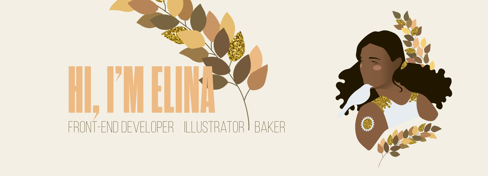

  
<b>✨&nbsp;&nbsp;About&nbsp;Me</b>

   

## :package: I'm a distributor of:
- Sugar :cake: for my mates _(ask politely)_
- Organization 
- Code
- Good humor :dancer:

## :microscope: I studied:
- Art
- Architecture
- Front-end
- Languages

## :dart: My next goals are:
- MySQL
- PHP
- Node.js
- Typescript

 

  
<b>📫&nbsp;&nbsp;How&nbsp;to&nbsp;reach&nbsp;me</b>

   
 
You can reach/follow me: 

 

  
<b>📫&nbsp;&nbsp;Some&nbsp;Statistics</b>

   

